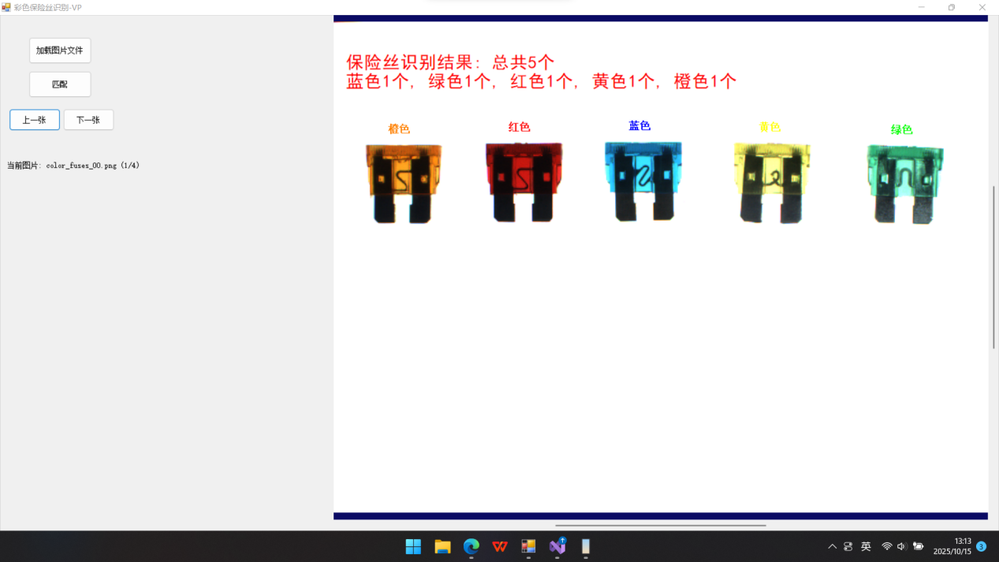

# ColorFuseVision-彩色保险丝识别与计数系统

本项目是基于C#和VisionPro开发的彩色保险丝定位与识别系统，用于自动识别和统计PCB板上的多颜色保险丝。系统通过模板匹配技术精确定位保险丝位置，利用颜色识别算法区分不同颜色的保险丝，并实现自动计数和结果可视化。

## 📂 项目结构

```
ColorFuseVision/
├── 📄 ColorFuse.sln                 # Visual Studio解决方案文件
├── 📄 ColorFuse.csproj              # C#项目配置文件
├── 📄 App.config                    # 应用程序配置文件
├── 📄 Program.cs                    # 程序主入口点
├── 📁 Properties/                   # 程序集属性配置
├── 📁 bin/                          # 编译输出目录
│   ├── 📁 Debug/                   # 调试版本输出
│   └── 📁 Release/                 # 发布版本输出
├── 📁 obj/                          # 编译中间文件
├── 📁 lib/                          # 依赖库目录
│   └── 📄 ColorFuse.vpp            # VisionPro工具块配置文件
├── 📁 img/                          # 图像资源目录
├── 📄 Form1.cs                      # 主窗体业务逻辑
├── 📄 Form1.Designer.cs             # 窗体设计器代码
├── 📄 Form1.resx                    # 窗体资源文件
└── 📄 README.md                     # 项目说明文档
```

## ✨ 核心功能

- **🔍 精准定位** - 采用CogPMAlignTool模板匹配技术，实现保险丝精确定位
- **🎨 多颜色识别** - 支持蓝色、绿色、红色、黄色、橙色五种颜色保险丝识别
- **📊 智能计数** - 自动统计各颜色保险丝数量，实时显示检测结果
- **🖼️ 批量处理** - 支持文件夹批量加载，自动排序和导航浏览
- **⚡ 高效性能** - 单张图像处理速度快，满足工业实时检测需求

## 🛠️ 技术栈

**开发语言**: C#  
**视觉平台**: Cognex VisionPro  
**界面框架**: Windows Forms  
**.NET版本**: .NET Framework 4.8  
**核心工具**: 
- CogToolBlock - 工具块集成
- CogPMAlignTool - 模板匹配定位
- CogCompositeColorMatchTool - 颜色识别

## 🚀 快速开始

### 环境要求

- **操作系统**: Windows 10/11
- **开发环境**: Visual Studio 2019+
- **运行依赖**: 
  - .NET Framework 4.8
  - Cognex VisionPro 9.0+
- **推荐配置**: Intel i5处理器, 8GB内存

### 编译运行

1. **打开项目**
```bash
# 使用Visual Studio打开解决方案
双击 ColorFuse.sln
```

2. **恢复NuGet包**
   - Visual Studio会自动恢复所需的NuGet包
   - 确保Cognex.VisionPro相关包正确安装

3. **配置工具块**
   - 确保`lib/ColorFuse.vpp`文件存在
   - 检查文件路径配置是否正确

4. **编译运行**
   - 按F5编译并运行程序
   - 或使用菜单"生成"→"生成解决方案"

### 使用说明

1. **启动应用**
   - 运行程序，系统自动加载视觉工具块
   - 查看标题栏确认工具块加载状态

2. **加载图像**
   - 点击"选择文件夹"按钮
   - 选择包含保险丝图像的文件夹
   - 系统自动加载并显示第一张图像

3. **执行检测**
   - 系统自动进行检测并显示结果
   - 使用导航按钮切换不同图像
   - 每次切换自动重新检测

## 📁 目录说明

### /lib
存放VisionPro工具块配置文件(`ColorFuse.vpp`)，这是视觉检测算法的核心配置文件。

### /img
用于存放测试图像文件，支持格式：JPG、JPEG、PNG、BMP、TIF、TIFF。

### /Properties
包含程序集信息、应用程序配置和资源文件。

### /bin
编译输出目录，包含调试(Debug)和发布(Release)版本的可执行文件。

### /obj
编译过程中生成的中间文件，通常不需要手动管理。

## 🔧 开发指南

### 主要代码文件

**Program.cs** - 应用程序入口点
```csharp
static class Program
{
    [STAThread]
    static void Main()
    {
        Application.EnableVisualStyles();
        Application.SetCompatibleTextRenderingDefault(false);
        Application.Run(new Form1());
    }
}
```

**Form1.cs** - 主窗体业务逻辑
- `LoadToolBlock()` - 加载VisionPro工具块
- `ProcessCurrentImage()` - 处理当前图像
- `NavigateToImage()` - 图像导航功能
- `UpdateStatusLabel()` - 更新界面状态

**Form1.Designer.cs** - 窗体设计器代码
包含Windows Forms界面控件的初始化代码。

### 配置文件

**App.config** - 应用程序配置
包含应用程序的运行时常量配置。

**ColorFuse.csproj** - 项目配置
定义项目依赖、编译设置和NuGet包引用。

## 🏭 应用场景

- **电子制造** - PCB板保险丝装配质量检测
- **汽车电子** - 保险丝盒颜色编码验证
- **家电生产** - 电路保护元件安装检查
- **质量管控** - 生产线自动化视觉检测

## 🤝 贡献指南

欢迎提交Issue和Pull Request来改进项目！

1. Fork本项目
2. 创建特性分支 (`git checkout -b feature/NewFeature`)
3. 提交更改 (`git commit -m 'Add NewFeature'`)
4. 推送到分支 (`git push origin feature/NewFeature`)
5. 创建Pull Request

## 📄 许可证

本项目采用MIT许可证。

## 📞 联系我们

- 项目主页：https://github.com/jianxi-erin/ColorFuseVision
- 问题反馈：请通过GitHub Issues提交

---

⭐ 如果这个项目对您有帮助，请给我们一个Star！